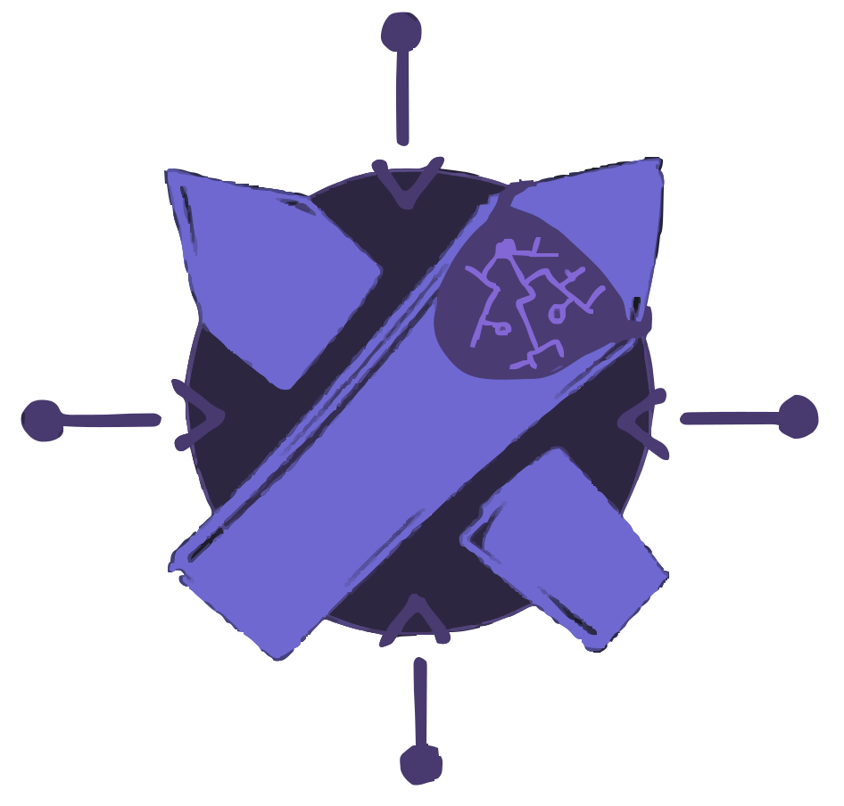

<div align="center">

# 🗡 Excalihub ️🎨



[](https://github.com/ZachLTech/excalihub/stargazers)
[](CONTRIBUTING.md)

*Your all-in-one hub for managing, creating, and organizing Excalidraw boards - free and open source*

[Demo](https://excalihub.zachl.tech) • [Features](#features) • [Installation](#installation) • [Contributing](#contributing)

</div>

---

## 🌟 Overview

Excalihub is a passion project born from the desire to create a free, open-source alternative to Excalidraw+ while offering even more powerful features. It's designed to be your central hub for managing all your Excalidraw whiteboards, with a focus on organization, collaboration, and extensibility.

> **Note:** Currently, Excalihub integrates with excalidraw.com for live sessions. Future updates will include support for both local and external Excalidraw sources, enabling seamless switching between large local projects and collaborative sessions on different hosts.

## ✨ Features

### Available Now
- 🗂️ **Aggregate**: Compil, create, and organize all your Excalidraw rooms in one place
- 📋 **Effortless Organization**: Keep everything neatly organized and easily accessible by archiving old rooms
- 🏠 **Self-Hosting**: Deploy your own instance for complete data sovereignty

### Coming Soon
- 📝 **Templates**: Create and use pre-formatted whiteboards for quick starts
- 💾 **Automatic Backups**: Never lose your work with automatic state snapshots
- 🏷️ **Smart Categorization**: Advanced organization with categories and special functionality
- 📑 **Multi-Tab Support**: Handle larger projects with tabulated whiteboards
- 🔄 **Local/External Sources**: Choose between local storage or external Excalidraw instances

## 🚀 Installation

### Prerequisites
- Docker and Docker Compose
- Git

### Quick Start with Docker

```bash
# Clone the repository
git clone https://github.com/ZachLTech/excalihub.git
cd excalihub

# Copy and configure environment variables
cp .env.example .env

# Build and run with Docker
docker-compose up -d
```

### Manual Development Setup

```bash
# Clone and install dependencies
git clone https://github.com/ZachLTech/excalihub.git
cd excalihub/app
npm install

# Configure environment
cp .env.example .env

# Start development server
npm run dev
```

## 🛠️ Configuration

Copy `.env.example` to `.env` and configure the following:

```env
AUTH_SECRET = super_secret_1 # String
PORT = 3000 # Port
POSTGRES_PORT = 5432 # Port
BASE_URL = http://localhost:3000 # String
AUTH_ORIGIN = localhost:3000 # String
ALLOW_SIGNUPS = true # Boolean
POSTGRES_USER = postgres # String || default 'postgres'
POSTGRES_PASSWORD = postgres # Secret || default 'postgres'
POSTGRES_DB = postgres # String || default 'postgres'
```

## 🤝 Contributing

Contributions are what make the open source community such an amazing place to learn, inspire, and create. Any contributions you make are **greatly appreciated**.

1. Fork the Project
2. Create your Feature Branch (`git checkout -b feature/AmazingFeature`)
3. Commit your Changes (`git commit -m 'Add some AmazingFeature'`)
4. Push to the Branch (`git push origin feature/AmazingFeature`)
5. Open a Pull Request


## 🔮 Future Plans

Excalihub is actively under development, with new features being added regularly. The roadmap includes:
- Enhanced template management
- Advanced backup systems
- Multi-tab whiteboard support
- Improved categorization
- Self-hosting capabilities
- Local/external source switching

Stay tuned for updates!

---

<div align="center">
Made with ❤️ by <a href="https://github.com/ZachLTech">ZachLTech</a>
</div>